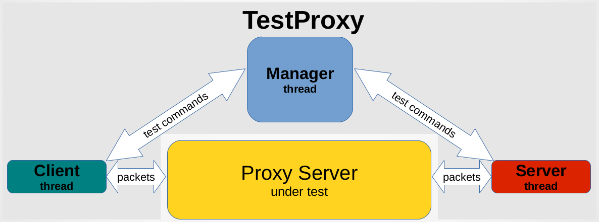

# TestProxy - Tool for end-to-end testing of proxy servers
[](https://crates.io/crates/testproxy)
[](https://travis-ci.org/sonertari/TestProxy)

Copyright (C) 2019, 2020, [Soner Tari](http://comixwall.org).
https://github.com/sonertari/TestProxy

## Overview

TestProxy is designed to be used for end-to-end testing of any program, such 
as a proxy server, which runs in between a client and a server, and 
communicates with them over networking packets.

A proxy server accepts connections from a client on the one side, and 
transfers the packets between that client and a server on the other side (it 
may or may not modify the packets it transfers). So, TestProxy acts as both 
the client and the server to simulate this environment. It starts a manager 
thread to run the tests, and in turn the manager thread starts a client and a 
server thread for each test. The manager sends commands to these client/server 
pairs to execute the tests it is started for.



TestProxy test steps are composed of a test end, a command, and a payload. For 
example, a test can instruct a client to send an HTTP request to the proxy 
server under test using the `send` command with a payload such as `GET / 
HTTP/1.1\r\nHost: example.com\r\n\r\n`. The next step of the same test can 
instruct the pairing server to receive this HTTP request from the proxy using 
the `recv` command with the same payload `GET / HTTP/1.1\r\nHost: 
example.com\r\n\r\n`, assuming the proxy is not expected to modify the 
payload. These send and receive steps of the test are called `states`, and are 
executed in the order they are numbered, as below.

```
"states": {
  "1": {
    "testend": "client",
    "cmd": "send",
    "payload": "GET / HTTP/1.1\r\nHost: example.com\r\n\r\n"
  },
  "2": {
    "testend": "server",
    "cmd": "recv",
    "payload": "GET / HTTP/1.1\r\nHost: example.com\r\n\r\n",
  }
}
```

This test becomes successful if both of these commands succeed, but it fails 
if either of the commands fails or the received payload does not match the 
expected payload of the `recv` command. Such tests may contain assertions too. 
See the sample tests under the `examples` folder in the sources to learn more 
about possible assertions.

Such tests can be saved in a JSON file to form a test set. The protocol and 
test ends of the test set are configured in the beginning of the file. The 
test set can be executed using multiple configuration. For example, the 
following test set specifies two configuration, which means that the tests in 
the test set will be executed twice, once for each configuration. Note that 
the first configuration is for TCP and the second is for SSL tests, and that 
the client and the server ports are different in each configuration. The proxy 
server under test should have been configured to accept connections on those 
client ports and to forward packets to those server ports.

```
"comment": "Tests for HTTP request/response",
"configs": {
  "1": {
    "proto": {
      "proto": "tcp"
    },
    "client": {
      "ip": "127.0.0.1",
      "port": "8181"
    },
    "server": {
      "ip": "127.0.0.1",
      "port": "9181"
    }
  },
  "2": {
    "proto": {
      "proto": "ssl",
      "crt": "server.crt",
      "key": "server.key"
    },
    "client": {
      "ip": "127.0.0.1",
      "port": "8444"
    },
    "server": {
      "ip": "127.0.0.1",
      "port": "9444"
    }
  }
},
"tests": {
  "1": {
    "comment": "Sends an HTTP request",
    "states": {
      ...
    }
  },
  "2": {
    "comment": "Receives an HTTP response",
    "states": {
      ...
    }
  }
}
```

Furthermore, such test sets can be bundled to form a test harness. For 
example, a sample test harness may be as follows:

```
{
  "comment": "Proxy end-to-end tests",
  "testharnesses": {
    "1": {
      "comment": "HTTP tests",
      "testsets": {
        "1": "http_testset_1.json",
        "2": "http_testset_2.json"
      }
    }
  }
}
```

One or more test harnesses can be saved in a JSON file. This is the file that 
the testproxy executable should be started with using the `-f` option. For 
example, the following is the screenshot of testproxy output when started with 
a `testharness.json` file and the debug level of 3 (which is the default, but 
TestProxy can produce detailed debug logs and very verbose trace logs as well):


In summary, the main test harnesses file may be composed of multiple test 
harnesses. Test harnesses may be divided into multiple test sets, which may be 
composed of tests defined in a test set file. Each test may contain multiple 
steps called states, and may contain assertions.

TestProxy runs multithreaded. Test harnesses are run serially, starting from 
the first one, but TestProxy starts a manager thread for each test set in the 
test harness. Manager thread runs the tests in its test set serially, but it 
starts a client and a server thread for each test in the test set. Manager 
thread communicates with those client and server threads over messaging 
channels, and expects execution results back.

TestProxy currently supports the TCP and SSL protocols.

## License

TestProxy is provided under the GPLv3 license.
